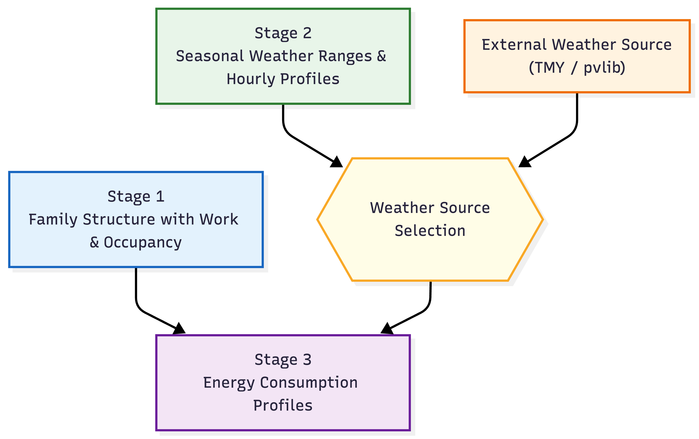
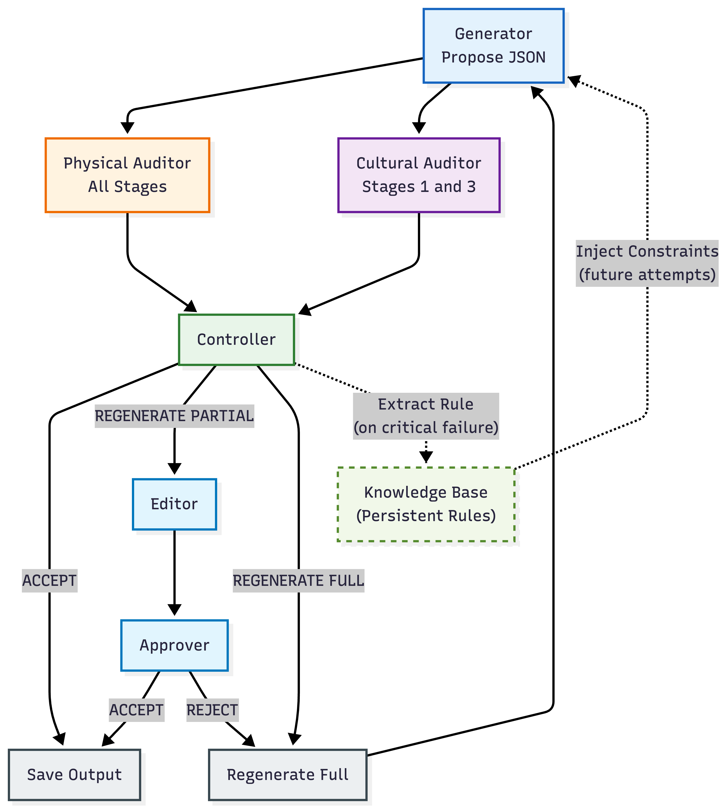

# 🔋 WattCouncil: Energy Framework

> A role-specialized LLM council framework for constraint-driven synthetic household energy consumption generation, based on the methodology from *"WattCouncil: Context-Aware Household Energy Scenario
Generation With Governed LLMs"*

---

## 📋 Table of Contents

- [Overview](#overview)
- [Architecture](#architecture)
- [Setup](#setup)
- [Configuration](#configuration)
- [Usage](#usage)
- [Analysis & Monitoring](#analysis-monitoring)
- [Advanced Features](#advanced-features)
- [Project Structure](#project-structure)
- [License](#license)


## <a id="overview"></a>🌟 Overview
> This framework implements an **LLM council** with specialized roles to generate realistic household energy consumption data through a **3-stage pipeline**. Each stage builds upon the previous one, creating a comprehensive narrative of household behavior and energy patterns.

<p align="center">

</p>

### The 3 Stages

| Stage | Name | Description |
|-------|------|-------------|
| 1️⃣ | **Family Generation** | Generate culturally appropriate household compositions and work regimes |
| 2️⃣ | **Weather Generation** | Generate seasonal weather profiles (using **LLM** or **TMY** real data) |
| 3️⃣ | **Consumption Patterns** | Generate hourly household energy consumption based on family and weather |

---

## <a id="architecture"></a>🏗️ Architecture

The framework uses **multiple LLMs with fixed roles**, ensuring separation of concerns and quality control:

<p align="center">

</p>

```
┌─────────────────────────────────────────────────────────────────────────┐
│                        🔮 LLM COUNCIL ROLES                             │
├─────────────────────────────────────────────────────────────────────────┤
│                                                                         │
│  🤖 PRIMARY GENERATOR                                                   │
│     └── Produces candidate structured outputs (JSON)                    │
│     └── LEARNS from "Knowledge Base" and "Feedback" on retry            │
│                                                                         │
│  🌍 CULTURAL AUDITOR                                                    │
│     └── Flags cultural/narrative inconsistencies                        │
│                                                                         │
│  📐 PHYSICAL AUDITOR                                                    │
│     └── Flags numerical/physical constraint violations                  │
│                                                                         │
│  ✏️  EDITOR                                                             │
│     └── Makes targeted fixes when CEO requests partial regeneration     │
│                                                                         │
│  ✅ APPROVER                                                            │
│     └── Verifies editor changes meet the guidance requirements          │
│     └── If REJECTED -> Triggers full regeneration (start over)          │
│                                                                         │
│  👨 ‍Controller (CEO)                                                    │
│     └── Final arbiter: ACCEPT / REGENERATE_PARTIAL / REGENERATE_FULL    │
│     └── Provides GUIDANCE for regeneration                              │
│                                                                         │
│  🧠 KNOWLEDGE BASE                                                      │
│     └── Persistent rule accumulation from critical failures             │
│                                                                         │
└─────────────────────────────────────────────────────────────────────────┘
```

---

## <a id="setup"></a>🚀 Setup

### Prerequisites

- Python 3.9+
- DeepInfra API key (or OpenRouter)

### Step 1: Install Dependencies

```bash
# Create conda environment
conda create -n llm_council python=3.11 -y

# Activate environment
conda activate llm_council

# Install requirements
pip install -r requirements.txt
```

### Step 2: Configure API Keys

```bash
# Copy the template
cp .env.example .env

# Edit .env and add your API key
nano .env  # or use your preferred editor
```

**Required in `.env`:**
```env
DEEPINFRA_API_KEY=your_actual_api_key_here

# Optional: OpenRouter as fallback
OPENROUTER_API_KEY=your_openrouter_key_here
```

### Step 3: Verify Setup

```bash
python -c "from council.config import Config; c = Config(); print('✅ Setup complete!')"
```

---

## <a id="configuration"></a>⚙️ Configuration

The framework uses a **multi-file configuration system**:

### 1. `config/runtime.yaml` - Runtime Configuration

Pipeline parameters that change per experiment.

```yaml
pipeline:
  country: "United Arab Emirates"
  year: 2024
  resume_from_checkpoint: false

stages:
  stage1_family:
    enabled: true
    num_families: 5
    num_variants: 1
  stage2_work_regime:
    enabled: true
    num_variants: 1
  # ... other stages
```

### 2. `config/runtime_targeted.yaml` - Targeted Experimentation

Targeted batches to match CER dataset.

```yaml
pipeline:
  country: "United Arab Emirates"
  year: 2024
  resume_from_checkpoint: false

# Stage-Specific Parameters
stages:
  stage1_families:
    enabled: true
    targeted_generation: true # Enable targeted mode
    num_variants: 2   # This will be used as the target variants count
    
    # Representative combinations filtered by (num_people, house_type, composition)
    representative_combos:
      - [1, 5, 1]  # Small (1 person), Bungalow, alone
      - [2, 4, 2]  # Small, terraced, adults_only
      - [3, 3, 2]  # Medium, detached, adults_only
      # - [3, 2, 3]  # Medium, semi-detached, with_kids
      # - [4, 3, 3]  # Large, detached, with_kids
```

### 3. `config/weather.yaml` - Weather Configuration

Capital coordinates and weather data settings.

```yaml
capitals:
  "United Arab Emirates":
    latitude: 24.4539
    longitude: 54.3773
  # ... other countries

southern_hemisphere:
  - "Australia"
  - "New Zealand"
  # ... other countries
```

### 4. `config/models.yaml` - Static Configuration

Model assignments, provider settings, and system paths.

### 5. `config/constants.yaml` - Centralized Constants

System defaults and hardcoded values extracted from code.

### 6. `config/model_costs.yaml` - LLM Pricing

Cost tracking per provider and model.

---

## <a id="usage"></a>🎯 Usage

### Run the Full Pipeline

```bash
# Use default config/runtime.yaml
python main.py

# OR use custom runtime.yaml
python main.py --config config/runtime_xyz.yaml

# Use TMY weather
python main.py --config config/runtime.yaml --weather-config config/weather.yaml

# Use targeted config
python main.py --config config/runtime_targeted.yaml

# Use targeted config with TMY weather
python main.py --config config/runtime_targeted.yaml --weather-config config/weather.yaml

```

---

## <a id="analysis-monitoring"></a>📈 Analysis & Monitoring

### Cost & Token Analysis

Use `scripts/analyze_logs.py` to analyze API usage:

```bash
# Analyze specific run
python scripts/analyze_logs.py outputs/run_20260206_090431
```

### Output Metrics

For each council member (model), the script reports:

- **Role**: Council role (e.g., Generator, Cultural Auditor, Physical Auditor, CEO)
- **Model**: Full model identifier
- **Calls**: Total number of API calls
- **Time (s)**: Cumulative execution time in seconds
- **In Tokens**: Total input tokens processed
- **Out Tokens**: Total output tokens generated
- **Cost ($)**: Estimated total cost in USD

### Example Output

```
Role               Model                               Calls  Time (s)   In Tokens    Out Tokens   Cost ($)  
─────────────────────────────────────────────────────────────────────────────────────────────────────────────
  Approver           mistralai/Mistral-Small-3.2-24B-... 0      0.0        0            0            0.0000    
  Ceo                Qwen/Qwen2.5-72B-Instruct           5      12.4       23,147       262          0.0239    
  Cultural Auditor   meta-llama/Llama-4-Maverick-17B-... 5      5.8        19,526       140          0.0030    
  Editor             meta-llama/Llama-3.3-70B-Instruc... 0      0.0        0            0            0.0000    
  Generator          google/gemini-2.5-flash             5      186.8      10,991       17,739       0.0476    
  Physical Auditor   anthropic/claude-4-sonnet           5      10.3       22,118       180          0.0760    
─────────────────────────────────────────────────────────────────────────────────────────────────────────────
✅ TOTAL                                                 20     215.2      75,782       18,321       0.1506    

  Average time per call: 10.76s
  Average cost per call: $0.0075
  Total pipeline cost:   $0.1506

```

---

## <a id="advanced-features"></a>🔄 Advanced Features

### Checkpoint System & Resume

The framework includes an **intelligent checkpoint system** that automatically saves progress and allows resuming interrupted runs, saving significant API costs.

#### How It Works

1. **Automatic Checkpointing** - Every generated item is immediately saved to `raw/` directories
2. **Corruption Detection** - Invalid files are automatically detected and skipped
3. **Smart Resume** - Only regenerates missing items, skips completed work

#### Usage

**Resume from specific run:**
```bash
# List available runs
ls -lt outputs/

# Resume from specific run directory
python main.py --resume run_20260112_153619
```

### Knowledge Accumulation & Feedback Loops

The architecture implements **two layers of learning**:

1.  **Immediate Feedback Loop (Regenerate Full)**:
    When the CEO rejects an output with `REGENERATE_FULL`, the specific *guidance* is injected back into the Generator's prompt for the next attempt. This allows the model to correct its course immediately.

2.  **Persistent Knowledge Base**:
    If a failure is critical or reveals a general rule (e.g., "Always ensure humidity is < 100%"), the CEO can extract a **persistent rule**. This rule is saved to `knowledge_base.txt` and is injected into the system prompt for *all future generations* in that run and subsequent runs. This prevents the council from repeating the same mistakes across different families or seasons.

---

## <a id="project-structure"></a>📁 Project Structure

```
llm_council_energy/
├── 📄 main.py                    # Main entry point - runs full pipeline
├── 📄 requirements.txt           # Python dependencies
├── 📄 .env.example               # Template for API keys
│
├── 📁 config/                    # Configuration files
│   ├── models.yaml               # Static config: models, providers
│   ├── runtime.yaml              # Runtime config: country, stages to run
│   ├── runtime_targeted.yaml     # Targeted experimentation config
│   ├── weather.yaml              # Weather config: TMY API settings, locations
│   ├── constants.yaml            # Centralized constants (defaults, paths)
│   └── model_costs.yaml          # LLM pricing per provider/model
│
├── 📁 council/                   # Core LLM council components
│   ├── client.py                 # Provider-agnostic LLM client
│   ├── generator.py              # Primary Generator
│   ├── auditors.py               # Cultural & Physical Auditors
│   ├── ceo.py                    # CEO decision maker
│   ├── editor.py                 # JSON Editor for targeted fixes
│   ├── approver.py               # Verifies editor changes
│   ├── pipeline.py               # Shared pipeline utilities
│   └── ...
│
├── 📁 prompts/                   # All LLM prompts (external files)
│   ├── stage1_family/            # Stage 1 prompts
│   ├── stage2_weather/           # Stage 2 prompts
│   ├── stage3_consumption/       # Stage 3 prompts
│   └── ...
│
├── 📁 schemas/                   # JSON schemas for validation
│   ├── stage1_family.json
│   ├── stage2_hourly_weather.json
│   └── stage3_consumption.json
│
├── 📁 utils/                     # Utility modules
│   ├── api_logger.py             # API call logging with costs/tokens
│   ├── tmy_weather.py            # TMY weather data processing
│   ├── checkpoints.py            # Checkpoint/resume functionality
│   └── ...
│
├── 📁 scripts/                   # Analysis and processing scripts
│   ├── analyze_logs.py           # Analyze API logs (costs, tokens)
│   ├── convert_outputs.py        # Convert JSON outputs to CSV
│   ├── extract_weather_sequence.py # Extract weather sequence from TMY data
│   └── ...
│
├── 📁 outputs/                   # Generated outputs (gitignored)
│   └── run_YYYYMMDD_HHMMSS/      # Timestamped run folder
│       ├── logs/                 # Run-specific logs
│       │   ├── pipeline.log
│       │   ├── api_calls_*.json
│       │   └── prompts/          # Saved composed prompts by role
│       ├── config/               # Snapshot of config files for this run
│       ├── raw/                  # Individual raw files per stage
│       ├── stage1_families_*.json
│       ├── stage2_hourly_*.json
│       └── stage3_consumption_*.json
|_
```

---

## <a id="license"></a>📜 License

Research infrastructure - use as needed.
